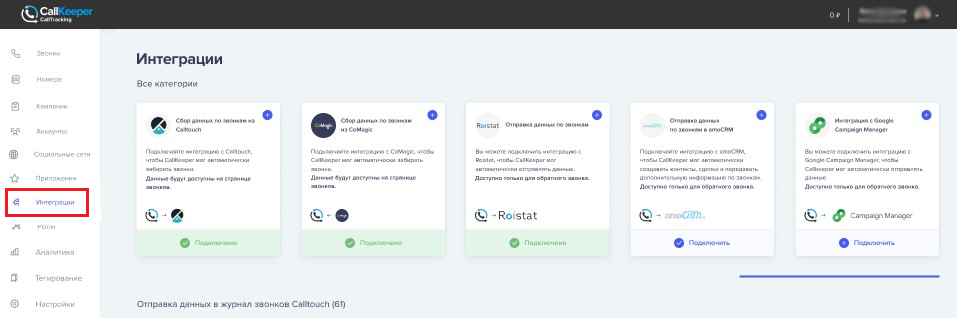
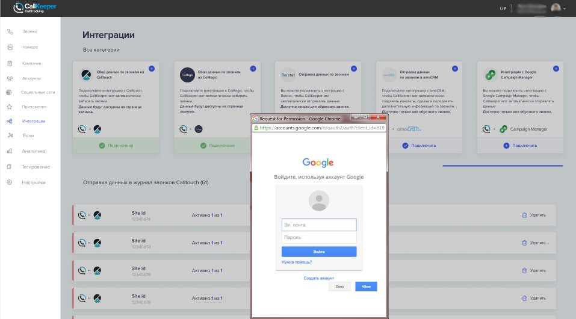
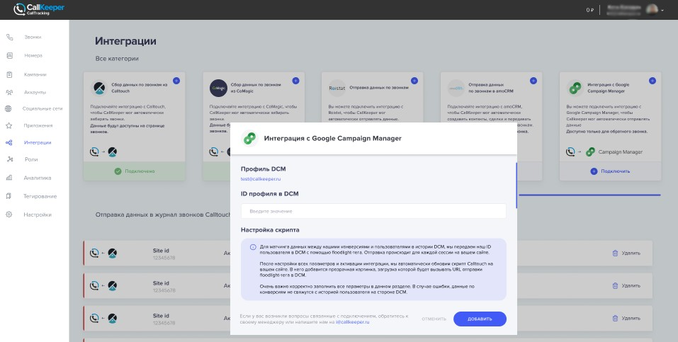
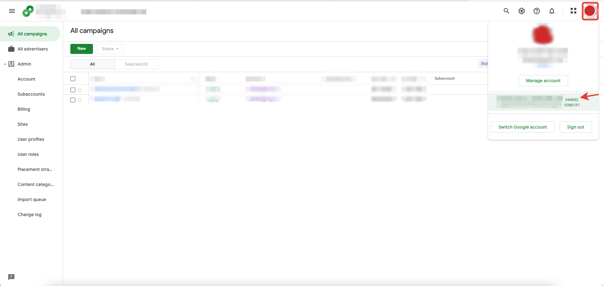
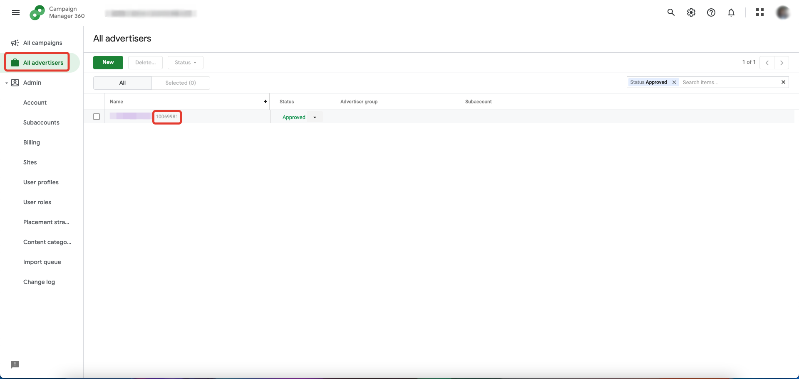
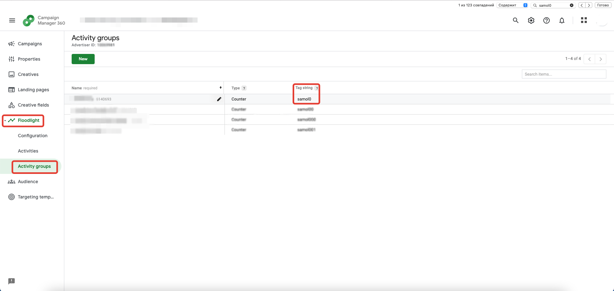
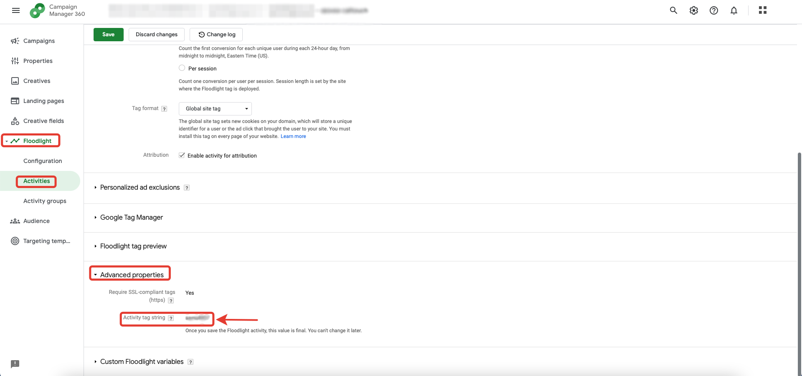
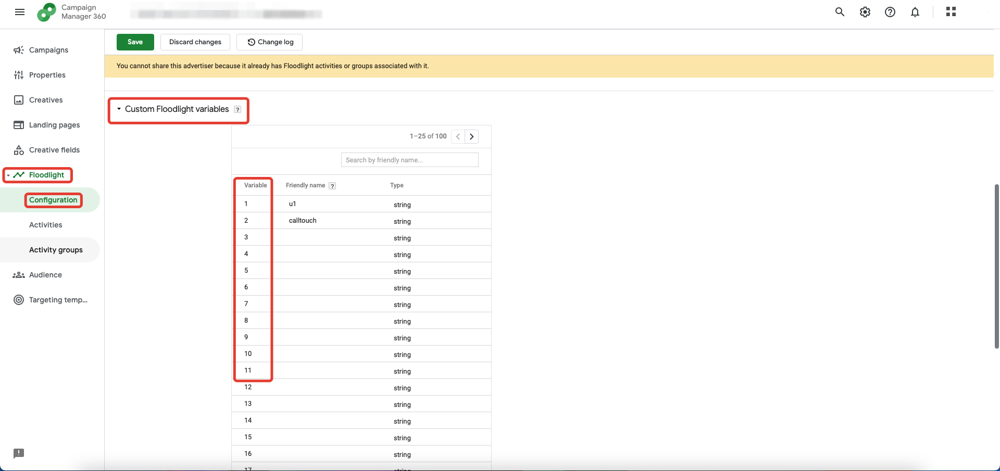

# Настройка интеграции с DCM

## Навигация
* [Об интеграции ](#Об-интеграции)
* [Схема интеграции ](#Схема-интеграции)
* [Настройка интеграции в личном кабинете CT ](#Настройка-интеграции-в-личном-кабинете-CT)

## Об интеграции

Вы можете анализировать рекламу любых медийных продуктов или просмотров видео. 
Для этого используйте пиксель DCM (DoubleClick Campaign Manager) в своих рекламных материалах. 
DCM начнет собирать данные по всем касаниям пользователя с вашей рекламой в цепочке с информацией о просмотре рекламы и переходах с нее на ваш сайт (информация по переходам доступна только для рекламных размещений в Google). 
С помощью интеграции с CT вы сможете настроить передачу в DCM данных по конверсиям. После этого, вам станет доступен полноценный post-view анализ по всем конверсионным цепочкам ваших медийных размещений.

**ВАЖНО!** По вопросам, связанным с настройкой floodlight-тегов, просмотром данных по конверсиям и конверсионным цепочкам в DCM обращайтесь, пожалуйста, к своему менеджеру в Google. 
Специалисты технической поддержки CT не имеют доступа к активному аккаунту DCM и не смогут вас проконсультировать.

## Схема интеграции

## Настройка интеграции в личном кабинете CT

Для того чтобы настроить интеграция DCM в личном кабинете CT необходимо:

**Привязка аккаунта гугл в ЛК CT**
- зайти в личный кабинет CT
- перейти во вкладку интеграции
- найти в списке интеграций Double Click и нажать " подключить "

- откроется окно для входа в Google аккаунт , где необходимо будет авторизоваться.

- затем появиться окно в котором необходимо будет ввести "ID профиля DCM", его можно будет найти кликнув по эконке профиля гугл в правом верхнем углу браузера "Гугл хром"

**Обратите внимание**, интеграцию нельзя включить, пока все поля не будут заполнены.

Сама настройка состоит из двух блоков: Настройка скрипта и Отправка событий по лидам.

**Настройка скрипта**

Тут необходимо внести данные по floodlight-тегу для онлайн-конверсий (сессий). 
(Сриншот ЛК ""настройка тега"")
В первом блоке есть следующие элементы:
1. ID профиля – ранее введенный ID, его нельзя менять;
2. src – id для отправки, только цифры, полный url не нужен (можно получить в DCM);

3. type – тип конверсии, цифры и латинские буквы (можно получить в DCM Floodlight - Activity groups);

4. cat – категория конверсии, цифры и латинские буквы. Что бы её получить, необходимо создать в разделе Activities - Advanced properties новую сущность, категория конверсии это Activity tag string

5. Пользовательские floodlight параметры. Их вы можете взять в разделе Floodlight - Configuration - Custom Floodlight variables

- Переменная u №1 – номер переменной «u», в которую передается ID для связи конверсий, вы указываете только ее номер в DCM;

- Переменная u №2 – номер переменной для передачи свободного параметра. Например, можно указать в ней название вашего проекта, латиницей. В первом поле задаете ее номер из DCM, во втором – значение. Это значение будет присвоено всем конверсиям;

- Переменная u для источника – номер переменной «u», в которую передается информация по рекламному источнику, вы указываете только ее номер в DCM;

- Переменная u для канала – номер переменной «u», в которую передается информация по рекламному каналу, вы указываете только ее номер в DCM;

- Переменная u для кампании – номер переменной «u», в которую передается информация по рекламной кампании, вы указываете только ее номер в DCM;

- Переменная u для объявления – номер переменной «u», в которую передается информация по рекламному объявлению, вы указываете только ее номер в DCM;

- Переменная u для ключевого слова – номер переменной «u», в которую передается информация по ключевому слову, вы указываете только ее номер в DCM.

[Вернуться к оглавлению](#навигация)

[Вернуться на главную](/README.md/#do
cumentation)