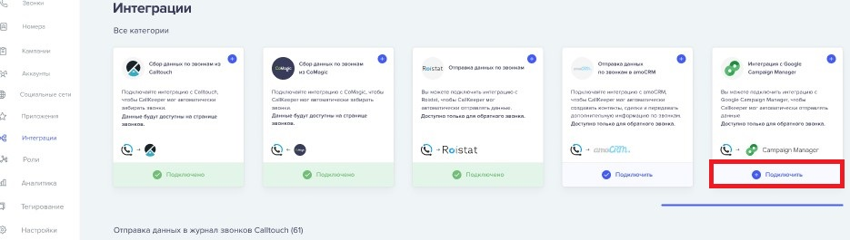
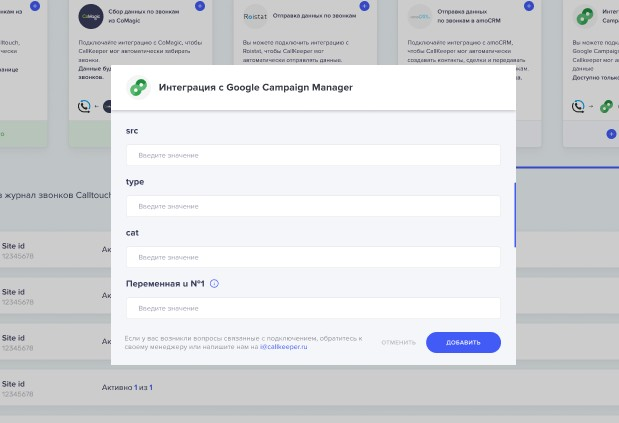
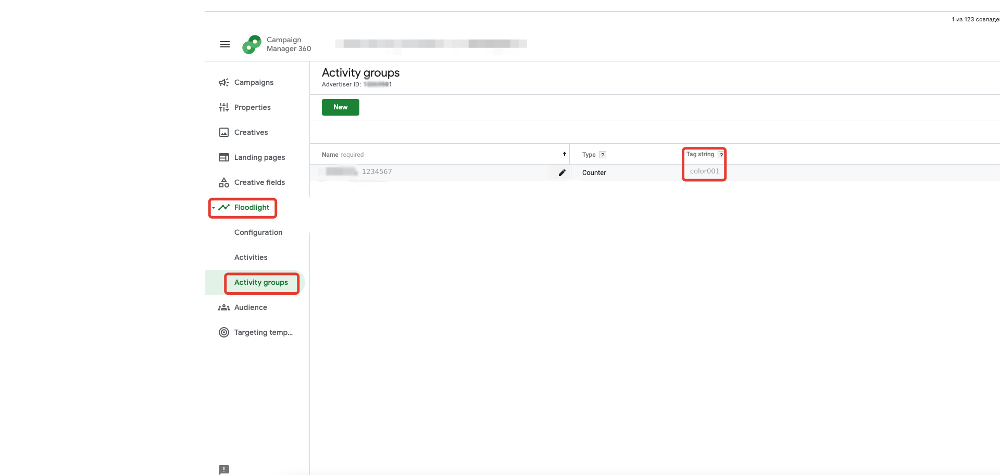
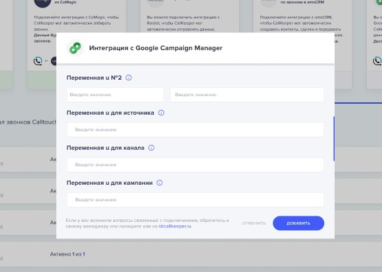
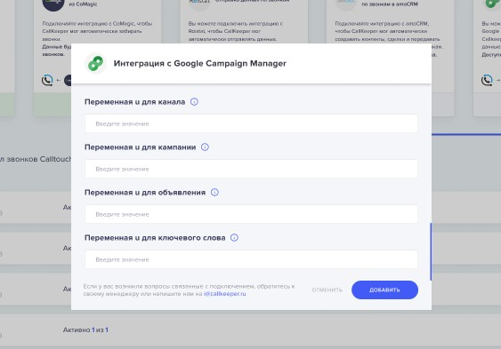

# Настройка интеграции с DCM

## Навигация
* [Об интеграции ](#Об-интеграции)
* [Настройка интеграции в личном кабинете CallTraking ](#Настройка-интеграции-в-личном-кабинете-CallTraking)

## Об интеграции

С помощью DCM вы сможете анализировать рекламу любых медийных продуктов или просмотров видео.

При интеграции DCM начнет собирать наднные по всем взаимодействиям пользователя с вашей рекламой вместе с информацией о просмотре рекламы и переходах с неё на ваш сайт (информация по переходам доступна только для рекламных размещений в Google). 

С помощью интеграции с CallTraking вы сможете настроить передачу в DCM данных по конверсиям. После этого, вам станет доступен полноценный анализ по всем конверсионным цепочкам ваших медийных размещений.

## Настройка интеграции в личном кабинете CallTraking

Для того чтобы настроить интеграция DCM в личном кабинете CallTraking необходимо:

**Привязать аккаунта Google в Личном кабинете CallTraking**
- зайти в личный кабинет CallTraking

- перейти во вкладку интеграции

- найти в списке интеграций Double Click и нажать " подключить "

- откроется окно для входа в Google аккаунт , где необходимо будет авторизоваться.

- затем появиться окно в котором необходимо будет ввести "ID профиля DCM", его можно будет найти кликнув по иконке профиля google в правом верхнем углу браузера "google chrome"

  
  **Обратите внимание**, интеграцию нельзя включить, пока все поля не будут заполнены.

  **Настройка интеграции**

  Поля которые необходимо будет заполнить :

  

1) src – id для отправки, только цифры, полный url не нужен (можно получить в DCM);

2) type – тип конверсии, цифры и латинские буквы (можно получить в DCM Floodlight - Activity groups);

3) cat – категория конверсии, цифры и латинские буквы. Что бы её получить, необходимо создать в разделе Activities - Advanced properties новую сущность, категория конверсии это Activity tag string

   

- Переменная u №1 – номер переменной «u», в которую передается ID для связи конверсий, вы указываете только ее номер в DCM;

- Переменная u №2 – номер переменной для передачи свободного параметра. Например, можно указать в ней название вашего проекта, латиницей. В первом поле задаете ее номер из DCM, во втором – значение. Это значение будет присвоено всем конверсиям;

- Переменная u для источника – номер переменной «u», в которую передается информация по рекламному источнику, вы указываете только ее номер в DCM;

- Переменная u для канала – номер переменной «u», в которую передается информация по рекламному каналу, вы указываете только ее номер в DCM;

- Переменная u для кампании – номер переменной «u», в которую передается информация по рекламной кампании, вы указываете только ее номер в DCM;

  

- Переменная u для объявления – номер переменной «u», в которую передается информация по рекламному объявлению, вы указываете только ее номер в DCM;

- Переменная u для ключевого слова – номер переменной «u», в которую передается информация по ключевому слову, вы указываете только ее номер в DCM.

[Вернуться к оглавлению](#навигация)

[Вернуться на главную](/README.md/#documentation)